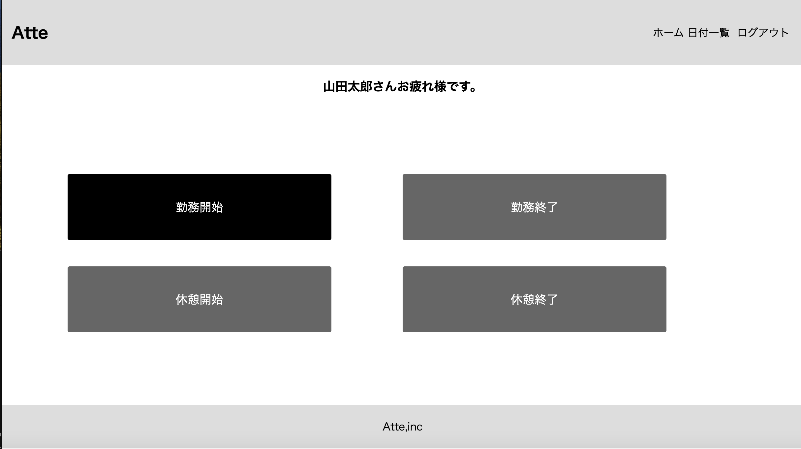
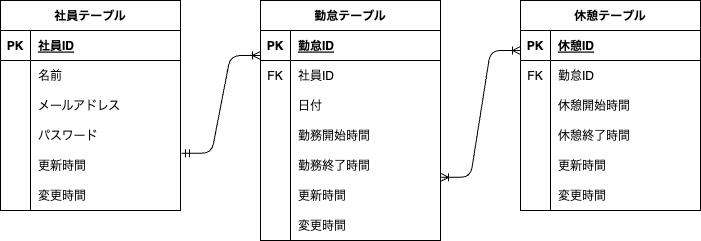
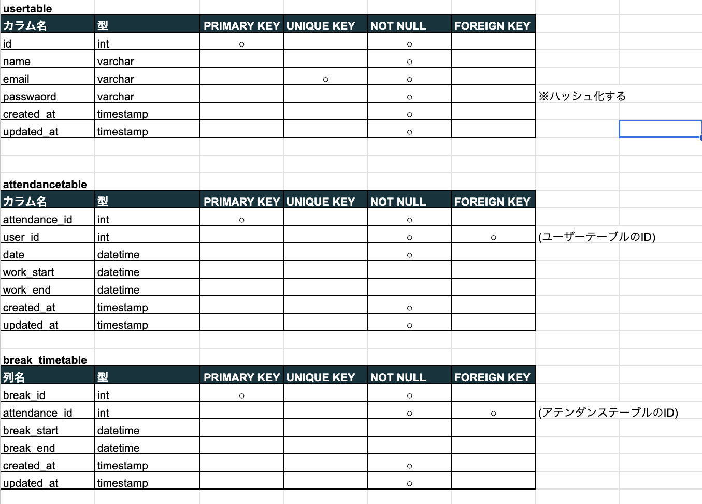

# アプリケーション名

勤怠管理システム『Atte』

## 作成した目的

クライアント企業の人事評価向上のため

## ER 図

## 機能一覧

laravel8 の fortify を使用
・新規登録、ログイン、ログアウト

・勤怠管理機能
勤務開始打刻
勤務終了打刻
休憩開始打刻
休憩終了打刻

・各社員の日付別勤怠表表示一覧機能

## 使用技術

Laravel8、PHP、MYSQL、NGINX

## テーブル設計

